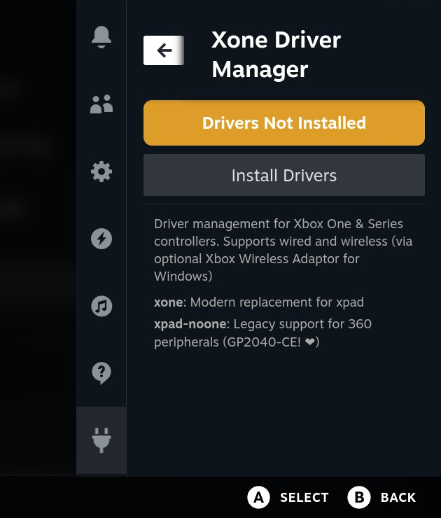
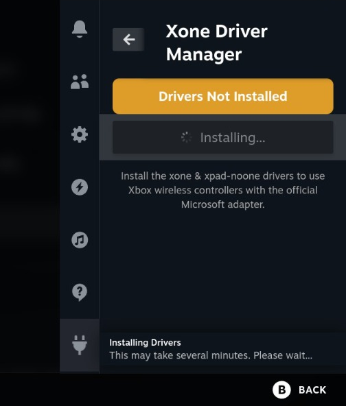
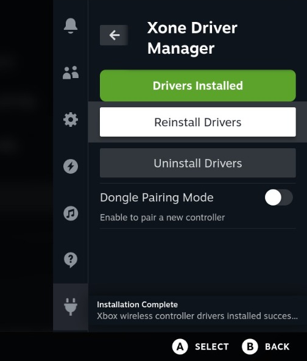

# Xone Driver Manager - Decky Plugin

A [Decky Loader](https://github.com/SteamDeckHomebrew/decky-loader) plugin to install and manage the [xone](https://github.com/dlundqvist/xone) Linux kernel driver for Xbox One and Xbox Series X|S accessories. 

xone is a modern replacement for xpad, aiming to be compatible with Microsoft's Game Input Protocol (GIP). Installing xone will disable the xpad kernel driver. If you still use Xbox or Xbox 360 peripherals, this plugin also installs [xpad-noone](https://github.com/forkymcforkface/xpad-noone) as a replacement for xpad.

## Features

- **One-click driver installation** - Install the xone and xpad-noone drivers directly from Gaming Mode
- **Easy uninstallation** - Remove drivers cleanly with a single click
- **Pairing mode control** - Enable/disable dongle pairing mode without leaving Gaming Mode
- **SteamOS update detection** - Automatically notifies you when drivers need reinstalling after a system update

## Screenshots

| Not Installed | Installing | Installed |
|:---:|:---:|:---:|
|  |  |  |

## Installation

### From Decky Plugin Store (Recommended)
1. Open Quick Access Menu (⋯ button)
2. Go to the Decky tab (plug icon)
3. Open the Plugin Store
4. Search for "Xone Driver Manager"
5. Click Install

### Manual Installation
1. Download the latest release from the [Releases](https://github.com/SavageCore/xone-decky-plugin/releases) page
2. Extract to `~/homebrew/plugins/xone-controller-manager/`
3. Restart Decky Loader

## Usage

1. Open Quick Access Menu (⋯ button)
2. Navigate to the Decky tab (plug icon)
3. Click on "Xone Driver Manager"
4. Click **Install Drivers** to install the drivers

### Pairing a Controller to the Dongle
1. Click the toggle to enable pairing mode (dongle LED will blink)
2. Hold the pairing button on your Xbox controller until the Xbox logo blinks rapidly
3. The controller will connect automatically
4. Disable pairing mode after successful connection

## After SteamOS Updates

When SteamOS updates, kernel modules are often removed. The plugin will detect this and show a notification prompting you to reboot and reinstall the drivers. Click **Reinstall Drivers** to restore functionality once you have rebooted.

## Requirements

- [Decky Loader](https://github.com/SteamDeckHomebrew/decky-loader) installed

## Credits

- [xone](https://github.com/dlundqvist/xone) - Modern Linux kernel driver for Xbox One and Xbox Series X|S accessories
- [xpad-noone](https://github.com/forkymcforkface/xpad-noone) - xpad replacement for legacy Xbox/Xbox 360 peripherals
- [Original install script](https://github.com/SavageCore/xone-steam-deck-installer) - My script this plugin is based on
- [Decky Loader](https://github.com/SteamDeckHomebrew/decky-loader) - The plugin framework

## License

BSD-3-Clause License - See [LICENSE](LICENSE) for details.
